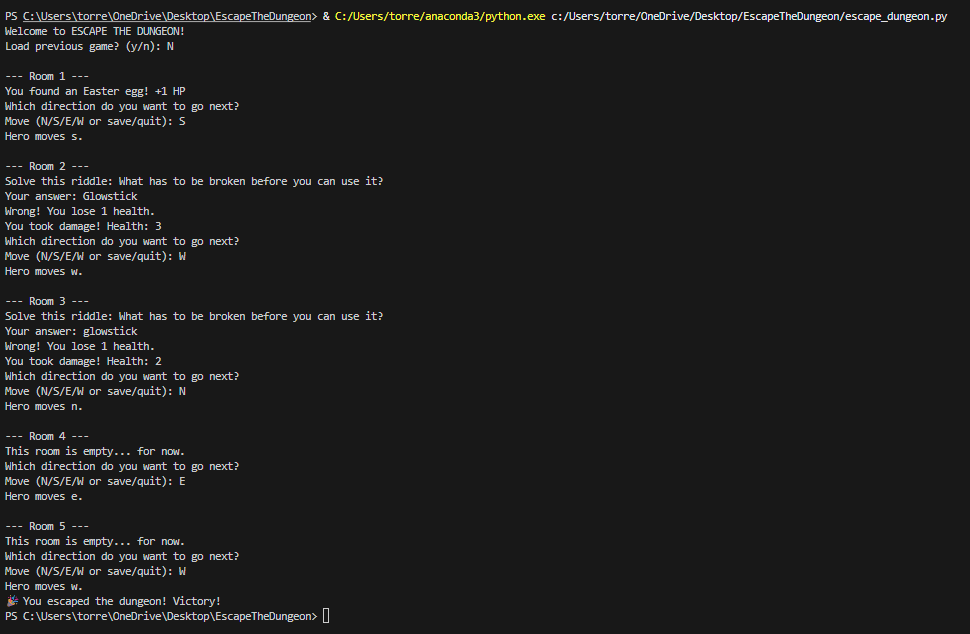

# Escape the Dungeon (Python Project)

Python-based application featuring an AI-driven enemy that adapts to user behavior, built using object-oriented programming and modular design.

## Features
- AI-driven enemy behavior
- Object-oriented programming design
- Save/load functionality
- Difficulty settings
- Randomized game events

## Technologies
- Python

## Demo

